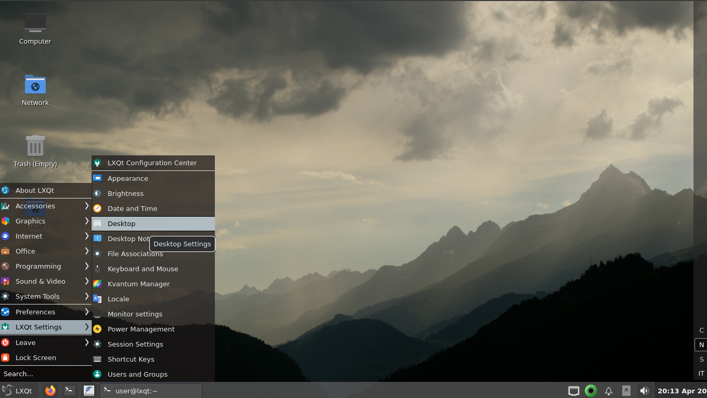

# Valendas
Translucent theme for the LXQt Desktop

Copy Valendas folder to /usr/share/lxqt/themes/ for system wide use or to ~/.local/share/lxqt/themes/ for single user.

A compositor has to be enabled to make transparency work - and not all widget styles support transparency everywhere,
breeze or oxygen do.

This theme is included in LXQt 1.1.0
